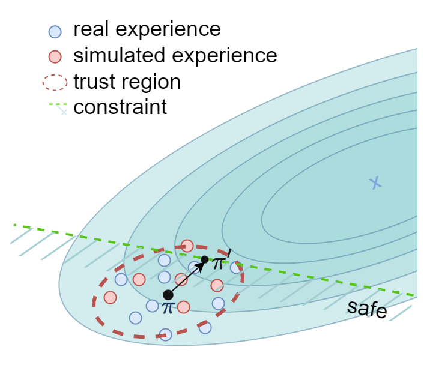
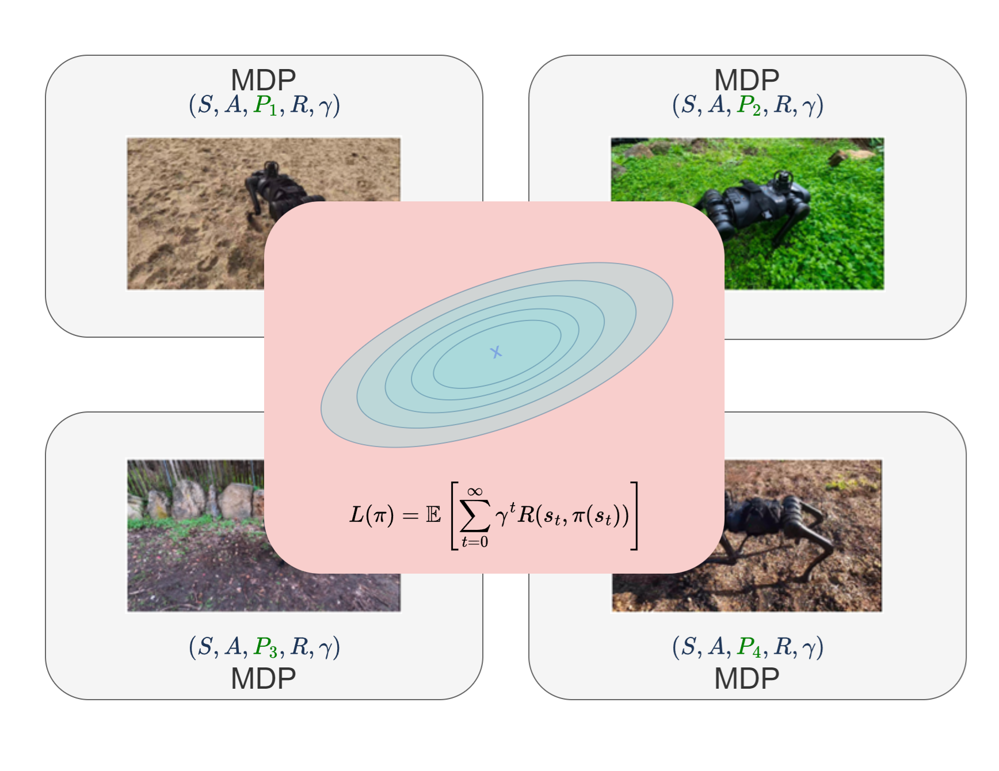
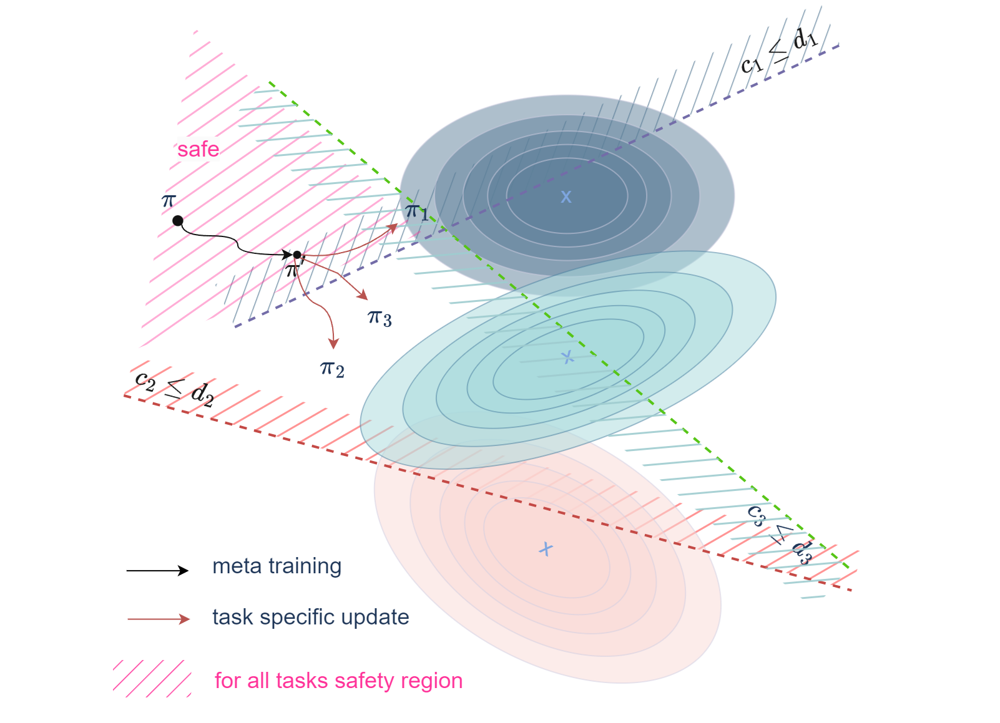

    

        <h3>Constrained Model-Based Policy Optimization (CMBPO)</h3>
        
Our research on Constrained Model-Based Policy Optimization (CMBPO) focuses on enhancing the safety and efficiency of robotic control systems through advanced model-based techniques.

        <a href="2024-06-12-research-cmbpo">Read more about CMBPO</a>
    

    

        
    

    

        <h3>Meta Adaptation Controller (MAC)</h3>
        
The Meta Adaptation Controller (MAC) study explores the adaptability of robotic behaviors across similar tasks using meta-learning strategies to improve both performance and safety.

        <a href="2024-06-12-research-mac">Read more about MAC</a>
    

    

        
    

    

        <h3>Constrained Meta Agnostic Reinforcement Learning (C-MAML)</h3>
        
In our Constrained Meta Agnostic Reinforcement Learning (C-MAML) project, we delve into integrating task-specific constraints into meta-learning frameworks to boost adaptability and applicability in diverse settings.

        <a href="2024-06-12-research-cmaml">Read more about C-MAML</a>
    

    

        
    

