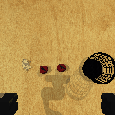
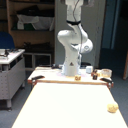
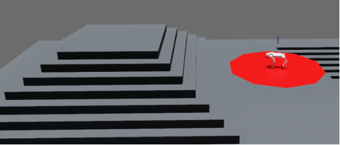

## Softwares
- [GymPanda RL Studio](#gympanda-rl-studio)
- [Safety Isaac Orbit/Lab](#safety-isaac)

## GymPanda RL Studio

**GymPanda RL Studio** is a straightforward software framework tailored for managing the [Franka Panda robot](https://franka.de/de/) using simple reinforcement learning techniques. This software allows users to explore different action spaces, from relative to absolute gripper positions, and supports various observation spaces, including pixel-based or state-based measurements. The designed environments are compatible with reinforcement learning frameworks like [Stable Baselines 3](https://github.com/DLR-RM/stable-baselines3). Additionally, the software is designed to be used without prior knowledge of [ROS](https://www.ros.org/), simplifying the learning curve for new users.

 

### GymPanda RL Studio Features

**Support for Various Sensors**
- Includes integration with internal robot sensors and depth cameras, enhancing the robot's perception and interaction capabilities.

**Pre-designed Tasks**
- Comes with pre-designed tasks such as reach and push, allowing for quick deployment and testing of robotic functions.

**Parallel Training**
- Supports parallel training on multiple robots within the Gazebo simulation environment, facilitating scalable and efficient robot learning.

**Visualization Capabilities**
- Offers advanced visualization tools to monitor robot operations and training processes in real-time.

**Integration with Robotics Toolbox**
- Fully integrated with the robotics toolbox, providing essential tools for inverse and forward kinematics, as well as dynamic calculations.

**Autonomous Learning Library**
- Utilizes a comprehensive autonomous learning library designed for developing, testing, and evaluating new algorithms directly on the robot.

### Demonstrations from Datasets
In the first part of our demonstrations, we utilized an episode from the [Viola dataset](https://www.tensorflow.org/datasets/catalog/viola) and implemented it on a real robot. The visual comparisons demonstrate the close alignment between the demonstrations collected from the dataset and the real-world behaviors observed.

  
  

### Demonstrations from Simulation
In the second part of our demonstrations, we generated a demo from [RLBench](https://sites.google.com/view/rlbench), which normally uses joint states as the action space. We converted these actions into relative inverse kinematic actions for execution on the robot. The observation space includes front and wrist camera views, providing comprehensive visual feedback on the robot’s interactions.

  
  
  
  

### Using Reinforcement Learning
We trained the agent using a simplified version of the environment through reinforcement learning, where the action space was limited to the position of the gripper. The task was a simple goal-reaching task. Only the front camera's observation was utilized for this training.
<iframe width="560" height="315" src="https://www.youtube.com/embed/MVICOvh-xxY" title="YouTube video player" frameborder="0" allow="accelerometer; autoplay; clipboard-write; encrypted-media; gyroscope; picture-in-picture" allowfullscreen></iframe>

## Safety Isaac Orbit/Lab

**Safety Isaac Orbit/Lab** is an innovative software framework developed to enhance the safe navigation and task performance of the [Unitree Go 2 robot](https://www.unitree.com/products/go2/edu) within constrained environments. This framework integrates safety constraints directly into the learning algorithms, significantly reducing the risk of mechanical strain and unsafe interactions. 
 

### Safety Isaac Orbit/Lab Features

**Robust Simulation Tools**
- Leverages Isaac Sim and Isaac Orbit/Lab to provide a realistic training environment that simulates various physical and sensor-based inaccuracies, enhancing the applicability of the trained models to real-world conditions.

**Dynamic Cost Management**
- Implements a cost manager that dynamically handles task-specific constraints, such as safety region violations, torque limitations to prevent mechanical damage, and penalties for premature termination of robot operations.

 

**Integration with Safe RL Frameworks**
- Initially used the Omnisafe package, recognized for its robust safety features, and later transitioned to the RSL_RL framework enhanced with a Lagrangian method to expedite the training process.

## Results

### Objective 1: Joint Torques
In our training simulations, we focus on minimizing joint torque to prevent mechanical damage and extend the lifespan of the robot. 

###  Using PPOLag (first order method)
PPOLag, or Proximal Policy Optimization with Lagrangian methods, is an advanced reinforcement learning algorithm designed to manage and optimize the balance between policy improvement and constraint satisfaction dynamically. This approach involves adjusting a penalty coefficient (lambda) in response to the degree of constraint violation observed during training. 

        

        <h3>PPO</h3>
        <!-- Embed the video for Lambda = 0.1 here -->
        <iframe style="width: 100%; height: auto; aspect-ratio: 16 / 9;" src="../assets/safety_orbit/vidoe_unconstrained.mp4" frameborder="0" allow="accelerometer; autoplay; clipboard-write; encrypted-media; gyroscope; picture-in-picture" allowfullscreen></iframe>
    

    

        <h3>PPOLag with threshold=0.05</h3>
        <!-- Embed the video for Lambda = 0.05 here -->
        <iframe style="width: 100%; height: auto; aspect-ratio: 16 / 9;" src="../assets/safety_orbit/vidoe_ppolag_05.mp4" frameborder="0" allow="accelerometer; autoplay; clipboard-write; encrypted-media; gyroscope; picture-in-picture" allowfullscreen></iframe>
    

###  Using P3O (first order method)
P3O, or Penalized Proximal Policy Optimization, builds on the traditional PPO framework by incorporating penalties directly related to the violation of specific constraints during training. This method is designed to improve policy compliance with safety and operational limits, making it particularly suitable for environments where adherence to constraints is as critical as performance optimization.
