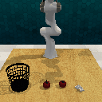

## Franka KIT

### Franka KIT Features

**Support for Various Sensors**
- Includes integration with internal robot sensors and depth cameras, enhancing the robot's perception and interaction capabilities.

**Pre-designed Tasks**
- Comes with pre-designed tasks such as reach and push, allowing for quick deployment and testing of robotic functions.

**Parallel Training**
- Supports parallel training on multiple robots within the Gazebo simulation environment, facilitating scalable and efficient robot learning.

**Visualization Capabilities**
- Offers advanced visualization tools to monitor robot operations and training processes in real-time.

**Integration with Robotics Toolbox**
- Fully integrated with the robotics toolbox, providing essential tools for inverse and forward kinematics, as well as dynamic calculations.

**Autonomous Learning Library**
- Utilizes a comprehensive autonomous learning library designed for developing, testing, and evaluating new algorithms directly on the robot.

### Demonstrations from Datasets

  
  
  

### Additional Camera Demonstrations

  
  
  
  

