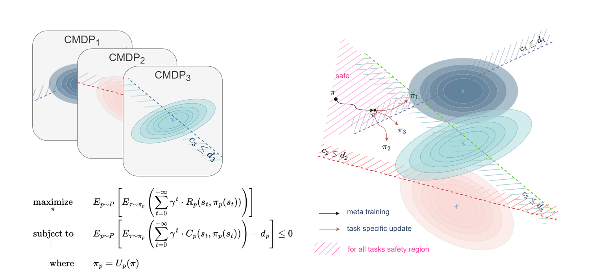

## Overview
This page introduces our groundbreaking research in Constrained Meta Agnostic Reinforcement Learning (C-MAML), a novel framework aimed at enhancing the adaptability and safety of meta-learning algorithms in robotic tasks and other dynamic environments.

## Research Highlights
Our research addresses the challenge of rapid adaptability in meta-reinforcement learning (Meta-RL) while adhering to crucial safety constraints. The newly developed C-MAML framework incorporates task-specific constraints directly into its learning algorithms during both the meta-training and adaptation phases. This approach not only speeds up the adaptation process to new tasks but also ensures that these adaptations comply with predefined safety standards.

- **Key Findings**:
  1. **Improved Safety**: C-MAML introduces a constraint-based method to the traditional Model Agnostic Meta Learning (MAML) framework, enhancing the safety of the learned meta-policies.
  2. **Efficient Adaptation**: The framework has been shown to enable rapid and efficient task adaptation, with experiments demonstrating significant performance improvements in simulated environments involving complex robotic locomotion tasks.
  3. **Robust Performance**: Our experiments highlight the practicality and robustness of C-MAML in various settings, showcasing its potential to revolutionize how machines learn and adapt in real-world applications.

- **Impact**:
  The integration of constraints into meta-learning models through C-MAML represents a significant step forward in the fields of robotics and artificial intelligence. It addresses critical issues in current learning methodologies by providing a safer, more adaptable learning process that is crucial for deployment in unpredictable environments.

- **Link to Full Document**: [Read the full research paper](https://github.com/karamdaaboul/karamdaaboul.github.io/blob/master/assets/praktikum_pdf/Constrained_Meta_Agnostic_Reinforcement_Learning.pdf){:target="_blank"}

## Figures and Visuals

*Figure 1: Visual representation of the Constrained Model Agnostic Meta Learning (C-MAML) framework. This schematic showcases the iterative optimization process where the meta-policy is trained across different tasks. Task-specific policies (\( \pi_1, \pi_2, \pi_3 \)) are adjusted within their respective constraint surfaces \( C_1, C_2, C_3 \), each with a dedicated safety boundary \( d_1, d_2, d_3 \).*

## Further Exploration
For those interested in further details about the technical aspects of C-MAML or its applications in different fields, consider exploring the following resources:
- [Meta-Learning in Robotics](https://example.com/meta_learning_robots)
- [Advanced Reinforcement Learning Techniques](https://example.com/advanced_rl_techniques)