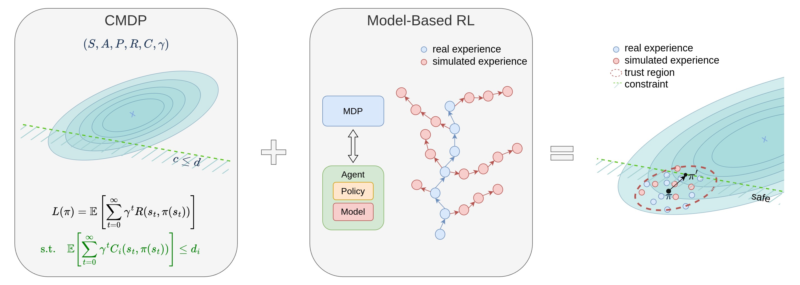

## Overview
This page presents our research on "Safe Continuous Control with Constrained Model-Based Policy Optimization," highlighting how constraints are integrated into reinforcement learning for safe robotic control. Our approach leverages the efficiency of model-based methods to optimize policies under these constraints effectively. This work was featured at the 2021 IEEE/RSJ International Conference on Intelligent Robots and Systems (IROS 2021).

## Research Highlights
Our research tackles the challenges of implementing safety constraints in reinforcement learning algorithms for robotic systems. We introduce a model-based safe exploration algorithm that reduces the high sample complexity typically associated with model-free approaches. The focus is on leveraging a learned model of system dynamics to enhance policy optimization under constraints, significantly reducing the number of training samples needed while maintaining safety.

- **Key Findings**:
Here are the enhanced key findings from the paper on "Safe Continuous Control with Constrained Model-Based Policy Optimization":

  1. **Boundary Formulation:** The paper introduces a performance boundary under model uncertainty, which quantifies the error due to discrepancies in state distribution and policy changes caused by model dynamics.

  2. **Model-based Adjustments:** It details how to accommodate model errors in policy optimization to ensure safety constraints are maintained, using trust-region methods that confine policy updates to areas where model predictions are deemed reliable.

  3. **Uncertainty Awareness:** The algorithm enhances safety by quantifying and incorporating model uncertainty awareness into the optimization process, using measures like the Kullback-Leibler divergence to manage and mitigate risks associated with inaccurate model predictions.

  4. **Practical Algorithm:** A practical algorithm is proposed that incorporates model uncertainty into the policy optimization process, ensuring both efficiency in learning and adherence to safety constraints.

- **Impact**:
  The methodology we've developed contributes to the broader field of robotics by enabling more efficient and safer automated systems, which are crucial as robots become increasingly integrated into human environments.

- **Link to Full Document**: [Read the full research paper](https://arxiv.org/abs/2104.06922){:target="_blank"}

## Methodology
Detailed explanation of the constrained model-based policy optimization technique, including its theoretical foundations and practical implementations.

## Figures and Visuals

*Figure 1: The left panel shows a Constrained Markov Decision Process (CMDP) with safety boundaries. The middle panel integrates this with a Model-Based Reinforcement Learning (RL) system, highlighting the use of both real and simulated experiences. The right panel demonstrates policy execution within safety and trust regions to ensure robust and safe operations.*

## Results
<iframe width="560" height="315" src="https://www.youtube.com/embed/a4MM9TxAYUM" title="YouTube video player" frameborder="0" allow="accelerometer; autoplay; clipboard-write; encrypted-media; gyroscope; picture-in-picture" allowfullscreen></iframe>

## Source Code
Access the implementation details and source code for further experimentation:
- **GitHub Repository**: [Constrained MBPO Implementation](https://github.com/anyboby/Constrained-Model-Based-Policy-Optimization)

## Further Reading
For those interested in exploring more about model-based reinforcement learning and safe exploration techniques:
- [Model-Based Reinforcement Learning](https://example.com/model-based-rl)
- [Safe Exploration in Robotics](https://example.com/safe-robotics)

