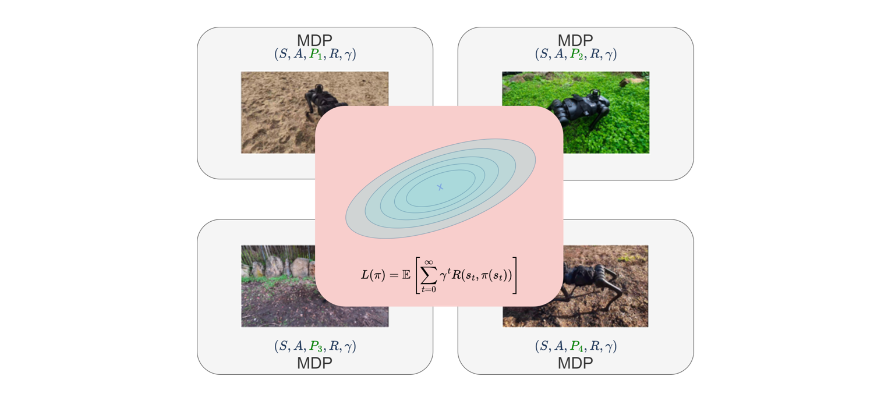

## Overview
This page delves into our research on "Robotic Control Using Model-Based Meta Adaptation," where we employ advanced meta-learning techniques to improve robotic adaptability in real-time and dynamic settings. This research has been published at the 2023 IEEE International Conference on Robotics and Automation (ICRA 2023).

## Research Highlights
Our study introduces the Meta Adaptation Controller (MAC), which utilizes Model-Based Meta-Reinforcement Learning (MB-MRL) to adapt robotic behavior rapidly across similar tasks without the need for designing complex reward functions. This technique allows robots to maintain preferred behaviors across varying environmental dynamics, significantly enhancing adaptability and safety.

- **Key Findings**:
  1. **Dynamic Adaptation Capability**: By utilizing model-based meta-learning combined with a task context embedding network, the controller demonstrates superior capability to adapt to sudden changes in environmental dynamics, such as different gravitational settings. This method enables effective adjustments without the need for reprogramming or extensive data collection. This capability is particularly significant for real-world applications where robots must operate under variable and unpredictable conditions, ensuring robust and adaptive performance.
  2. **Efficiency of Behavior Transfer**: The Meta Adaptation Controller (MAC) improves behavior transfer efficiency by modifying the model predictive control (MPC) objective function and using the collocation method instead of the traditional shooting method for optimization. This enables the MAC to apply behaviors learned from a reference task more effectively across similar tasks, ensuring consistent performance across different conditions without extensive retraining.
  3. **Reduction in Reward Function Complexity:** The introduction of the Meta Adaptation Controller (MAC) helps bypass the complex and time-consuming process of designing tailored reward functions for different tasks. By using a meta-learning framework, the system can replicate behaviors from a reference task across similar tasks without the need to individually adjust the reward criteria for each new environment. This streamlines the setup process and focuses on achieving consistent outcomes across various tasks.

- **Impact**:
  The integration of MAC in robotic systems addresses crucial challenges in robotics, particularly in environments where rapid adaptability is essential. This research contributes to the development of more autonomous and efficient robotic systems capable of handling real-world complexities.

- **Link to Full Document**: [Read the full research paper](https://arxiv.org/abs/2210.03539f){:target="_blank"}

## Figures and Visuals

*Figure 1: Adaptive behaviors of robots using MAC during different task scenarios.*

## Results
<iframe width="560" height="315" src="https://www.youtube.com/embed/0KqIinXb84Y" title="YouTube video player" frameborder="0" allow="accelerometer; autoplay; clipboard-write; encrypted-media; gyroscope; picture-in-picture" allowfullscreen></iframe>

## Source Code
For those interested in the technical implementation:
- **GitHub Repository**: [MAC Implementation](https://github.com/jikels/mac)

## Further Exploration
Explore related topics and further readings:
- [Model-Based Reinforcement Learning](https://example.com/model-based-rl)
- [Meta-Learning in Robotic Systems](https://example.com/meta-learning-robots)